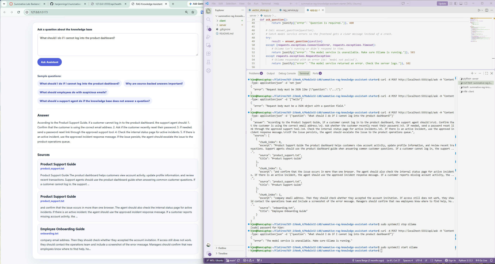

# Summative Lab: Local RAG-Powered Knowledge Assistant
**Completed Oct 1, 2026**

## Overview
A local full-stack AI application that answers employee questions using a small set of approved company documents. It combines a React (Vite) frontend, a Flask backend, a Chroma vector database, and Ollama-hosted models into a retrieval-augmented generation (RAG) workflow that returns answers along with the sources they came from.



## Problem Definition

Employees often need quick answers about onboarding, product support, security practices, and workplace policies, but searching through multiple documents is slow, and general-purpose AI tools can give confident answers that aren't based on company policy. This assistant is designed for internal employees, such as new hires and support agents, who need practical answers drawn only from four approved knowledge base documents. A useful answer is clear, actionable, and limited to what the documents actually say. Because answers can affect how employees handle customers and security incidents, each response includes the supporting sources so users can verify the information, and the assistant says when the knowledge base doesn't cover a question instead of guessing.

## Architecture

```
User browser
→ React frontend (client/src/App.jsx)
→ POST /api/ask (server/app.py)
→ answer_question() (server/rag_service.py)
   → retrieve_relevant_chunks() (server/vector_store.py)
        → embed the question with Ollama (nomic-embed-text)
        → query Chroma for the closest chunks + source metadata
   → build_prompt() with the question and retrieved context
   → call_generation_model() with Ollama (llama3.2)
   → format_sources()
→ JSON { answer, sources } returned to the frontend
```

The knowledge base is indexed separately by a seed script:

```
seed_knowledge_base.py
→ load_text_documents() + build_chunks() (server/documents.py)
→ seed_vector_store() (server/vector_store.py)
   → embed each chunk with Ollama
   → upsert chunks, embeddings, and metadata into Chroma
```

## Project Structure

```
├── client/                  React + Vite frontend
│   └── src/App.jsx          Chat interface, answer and source display
├── server/
│   ├── app.py               Flask routes (/api/health, /api/ask)
│   ├── config.py            Loads settings from .env
│   ├── documents.py         Loads and chunks knowledge base files
│   ├── vector_store.py      Chroma setup, embeddings, seeding, retrieval
│   ├── rag_service.py       RAG workflow: retrieve, prompt, generate, format
│   ├── seed_knowledge_base.py  Indexes the knowledge base into Chroma
│   ├── knowledge_base/      Approved source documents (.txt)
│   ├── requirements.txt
│   └── .env.example
└── README.md
```

## Installation

### Prerequisites

- Python 3.10+
- Node.js and npm
- [Ollama](https://ollama.com) installed and running

### 1. Pull the Ollama models

```bash
ollama pull llama3.2
ollama pull nomic-embed-text
```

Confirm the generation model responds:

```bash
ollama run llama3.2 "Reply with one short sentence."
```

### 2. Set up the backend

From the project root:

```bash
cd server
python -m venv .venv
source .venv/bin/activate        # Windows PowerShell: .venv\Scripts\Activate.ps1
pip install -r requirements.txt
cp .env.example .env
```

### 3. Build the vector database

The Chroma database is not committed to the repository. Build it from the provided knowledge base:

```bash
python seed_knowledge_base.py
```

Expected output:

```
Loaded 4 documents.
Prepared 9 chunks.
Stored 9 chunks in collection 'knowledge_assistant'.
```

The script uses `upsert`, so it is safe to run again. Re-running it keeps the collection at 9 chunks instead of creating duplicates. Re-run it after editing any file in `knowledge_base/`.

### 4. Set up the frontend

From the project root:

```bash
cd client
npm install
```

## Running the App

The app needs **two terminals**, and Ollama must be running.

**Terminal 1: Flask backend** (from `server/`, with the virtual environment active):

```bash
flask --app app run --debug --port 5555
```

Check that it's running by visiting http://localhost:5555/api/health.

**Terminal 2: React frontend** (from `client/`):

```bash
npm run dev
```

Open the URL shown in the terminal, usually http://localhost:5173.

## Environment Variables

Copy `server/.env.example` to `server/.env`. The `.env` file is ignored by Git.

| Variable | Purpose | Example |
| --- | --- | --- |
| `OLLAMA_BASE_URL` | URL of the local Ollama service | `http://localhost:11434` |
| `GENERATION_MODEL` | Model that writes answers | `llama3.2` |
| `EMBEDDING_MODEL` | Model that creates embeddings | `nomic-embed-text` |
| `CHROMA_PATH` | Folder where Chroma stores vector data | `./chroma_db` |
| `COLLECTION_NAME` | Name of the Chroma collection | `knowledge_assistant` |
| `KNOWLEDGE_BASE_PATH` | Folder containing source documents | `./knowledge_base` |
| `TOP_K` | Number of chunks retrieved per question | `3` |
| `TEMPERATURE` | Response variation (lower = more focused) | `0.2` |
| `FLASK_DEBUG` | Enables Flask debug mode | `True` |
| `CLIENT_ORIGIN` | Frontend origin allowed by CORS | `http://localhost:5173` |

## API Routes

### `GET /api/health`

Confirms the backend is running.

```json
{
  "status": "ok",
  "message": "Backend is running."
}
```

### `POST /api/ask`

Receives a question, runs the RAG workflow, and returns an answer with supporting sources.

**Request:**

```json
{
  "question": "What should I do if I cannot log into the product dashboard?"
}
```

**Success response (`200`):**

```json
{
  "answer": "A helpful answer grounded in the knowledge base.",
  "sources": [
    {
      "title": "Product Support Guide",
      "source": "product_support.txt",
      "chunk_index": 0,
      "excerpt": "Relevant source excerpt..."
    }
  ]
}
```

**Error responses:**

| Status | When | Response |
| --- | --- | --- |
| `400` | Body is missing, not valid JSON, or not a JSON object | `{"error": "Request body must be a JSON object with a question field."}` |
| `400` | `question` is not a string | `{"error": "Question must be a string."}` |
| `400` | `question` is missing or blank | `{"error": "Question is required."}` |
| `502` | Ollama responded with an error (for example, a model that isn't pulled) | `{"error": "The model service returned an error. Check the server logs."}` |
| `503` | Ollama is not running or did not respond in time | `{"error": "The model service is unavailable. Make sure Ollama is running."}` |

## RAG Workflow

1. **Receive the question.** The frontend sends the user's question to `POST /api/ask`. The route validates the input and passes the question to `answer_question()`.
2. **Retrieve relevant chunks.** The question is embedded with `nomic-embed-text` through Ollama's `/api/embed` endpoint. Chroma compares that embedding with the stored chunk embeddings and returns the `TOP_K` closest chunks, along with their source metadata (`source`, `title`, `chunk_index`) and distance scores.
3. **Build the prompt.** The retrieved chunks are labeled with their titles and filenames and combined with the question. The prompt instructs the model to use only the provided context, to say when the context isn't enough, and not to invent policies or steps.
4. **Call the model.** The prompt is sent to `llama3.2` through Ollama's `/api/generate` endpoint as a non-streaming request, using the configured temperature.
5. **Return the answer and sources.** The backend returns the generated answer, plus a list of sources with titles, filenames, chunk numbers, and short excerpts. The frontend displays both.

The knowledge base is indexed ahead of time by `seed_knowledge_base.py`, which loads the four `.txt` files, splits them into overlapping 120-word chunks, embeds each chunk, and upserts them into Chroma with their source metadata.

## Sample Questions and Observations

All questions were tested through the frontend. Each returned a `200` status, and no application errors appeared in the Flask terminal or browser console.

| Sample Question | Was the Answer Relevant? | Were Useful Sources Returned? | Notes |
| --- | --- | --- | --- |
| What should I do if I cannot log into the product dashboard? | Yes | Yes | The answer listed the support steps from the Product Support Guide in order (check email, ask about password resets, send a reset link, check the status page, escalate). Two sources came from `product_support.txt`. The third, from `onboarding.txt`, covers *employee* login issues, so it's related but less relevant. |
| What should employees do with suspicious emails? | Yes | Yes | The top two sources came from `security_guidelines.txt` (distances ≈ 0.50). One step included the stray phrase "for an approved work task" because a chunk began mid-sentence and the model blended that fragment into its answer. |
| What is the company's parental leave policy? *(not covered by the knowledge base)* | Yes, it correctly declined | No | The assistant said it didn't have enough information from the knowledge base and didn't invent a policy. Chroma still returned the three closest chunks, which aren't about parental leave. |
| What's the capital of France? *(off-topic)* | Yes, it correctly declined | No | It declined correctly but described the knowledge base as covering "internal assistants," a slight mischaracterization. |
| password *(single keyword)* | Mostly | Yes | Retrieval found relevant security content (strong passwords, MFA, not sharing passwords, resetting exposed passwords). The final point may combine the onboarding guide's login guidance with password resets. |

### Additional checks

- **Blank question in the UI:** the frontend blocks submission with "Enter a question before submitting." The backend also rejects blank questions with a `400`.
- **Invalid request bodies (tested with curl):** a numeric question, a JSON list, and non-JSON text each return a `400` with a clear message.
- **Ollama stopped:** `/api/ask` returns a `503` with a clear message instead of crashing.
- **Re-seeding:** running the seed script twice keeps the collection at 9 chunks.

## Refinements Made

- **Fixed noisy telemetry errors:** Chroma 0.5.5 printed `Failed to send telemetry event` errors because of a version mismatch with the `posthog` library. Pinned `posthog<6` in `requirements.txt` and disabled Chroma telemetry.
- **Corrected the embedding request format:** Ollama's `/api/embed` endpoint expects `"input"` (not `"prompt"`) and returns a list of embeddings, so the code sends `"input"` and takes the first embedding.
- **Prevented duplicate chunks:** used `upsert` with stable chunk IDs so the knowledge base can be re-seeded safely.
- **Added input validation:** `/api/ask` rejects non-object bodies and non-string questions with a `400` instead of returning a `500`.
- **Added model service error handling:** connection failures and timeouts return a `503`, and Ollama error responses return a `502`, so the frontend gets a clear message.
- **Included distance scores in retrieval results:** each retrieved chunk carries its Chroma distance (the optional score from the starter TODO), which made it possible to compare retrieval quality across test questions.

## Known Limitations and Future Improvements

- **Chunks can split mid-sentence.** Chunking is based on word count, so a chunk can start or end partway through a sentence, which occasionally causes the model to blend unrelated phrases. Sentence- or paragraph-aware chunking would improve this.
- **Irrelevant sources are still shown.** Chroma always returns the `TOP_K` closest chunks, even when none are relevant, so off-topic questions still display sources. A distance threshold could filter out weak matches.
- **Prompt wording leaks into answers.** Answers often begin with "According to the provided context," which isn't meaningful to employees. Adjusting the prompt instructions could produce more natural answers.
- **Answer formatting.** Numbered steps in answers display as one paragraph because line breaks aren't preserved in the frontend. Preserving line breaks would improve readability.
- **Similar-looking sources.** Two chunks from the same file display with identical titles. Showing the chunk or section number would help users tell them apart.
- **Hard-coded request timeout.** Ollama requests use a fixed 120-second timeout, which could be moved to an environment variable.
- **No chat history or feedback.** Each question is independent. Future versions could save conversation history and let users mark answers as helpful or unhelpful.
